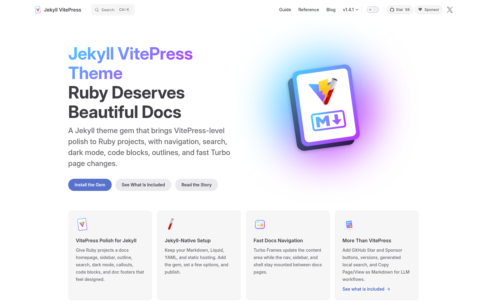
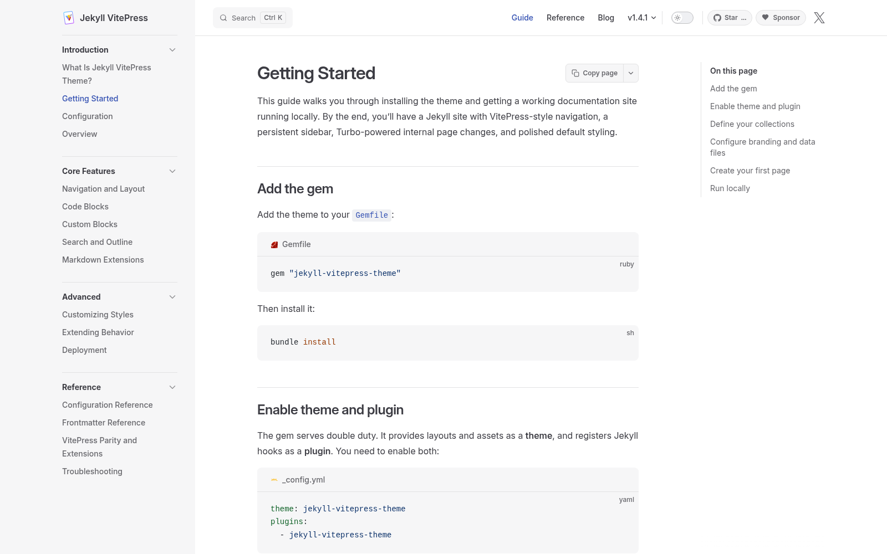

<div align="center">


# Jekyll VitePress Theme

<strong>Turbo-fast documentation for Jekyll projects.</strong>

[](https://rubygems.org/gems/jekyll-vitepress-theme)
[](https://github.com/crmne/jekyll-vitepress-theme/actions/workflows/main.yml)
[](https://jekyll-vitepress.dev)
[](LICENSE)

</div>

---

Ruby projects should not need a JavaScript app just to get beautiful, fast docs.

`jekyll-vitepress-theme` brings the VitePress documentation experience to Jekyll: the familiar nav, sidebar, outline, search, code blocks, dark mode, and polished default theme, packaged as a Ruby gem.

The unusual part is navigation. Internal docs links use Turbo Frames, so page changes feel close to VitePress while the site remains plain Jekyll output: Markdown, Liquid, YAML, Ruby, and static files.

## Why Use It

- **VitePress-like UX:** top nav, persistent sidebar, right outline, doc footer pager, search modal, and theme toggle.
- **Turbo page navigation:** only the docs content frame swaps, so the shell stays in place and page changes feel fast.
- **Jekyll-native setup:** configure everything with `_config.yml`, `_data/*.yml`, collections, includes, and frontmatter.
- **Ruby syntax pipeline:** Rouge powers light and dark syntax themes without a separate JavaScript build.
- **Static deployment:** build once with Jekyll and publish to GitHub Pages, any CDN, or any static host.
- **Useful extras:** GitHub star count, version selector, last-updated labels, copy buttons, and "Copy page" Markdown export.

## Quick Start

Add the gem:

```rb
gem "jekyll-vitepress-theme"
```

Enable the theme and plugin:

```yaml
theme: jekyll-vitepress-theme
plugins:
  - jekyll-vitepress-theme
```

Add basic theme config:

```yaml
jekyll_vitepress:
  branding:
    site_title: My Docs
  syntax:
    light_theme: github
    dark_theme: github.dark
```

Define navigation and sidebar data:

```yaml
# _data/navigation.yml
- title: Guide
  url: /getting-started/
  collections: [guides]
```

```yaml
# _data/sidebar.yml
- title: Guide
  collection: guides
```

Run Jekyll:

```sh
bundle install
bundle exec jekyll serve --livereload
```

## Screenshots

| Home | Docs |
| --- | --- |
|  |  |

## Docs

Read the full documentation at **[jekyll-vitepress.dev](https://jekyll-vitepress.dev)**.

Start here:

- [Getting Started](https://jekyll-vitepress.dev/getting-started/)
- [Configuration](https://jekyll-vitepress.dev/configuration/)
- [Navigation and Layout](https://jekyll-vitepress.dev/navigation-layout/)
- [Search and Outline](https://jekyll-vitepress.dev/search-and-outline/)
- [Configuration Reference](https://jekyll-vitepress.dev/configuration-reference/)

## Development

```sh
bundle install
npm install
bundle exec jekyll serve --livereload
```

Run the local verification suite:

```sh
bundle exec rake verify
```

## License

MIT
